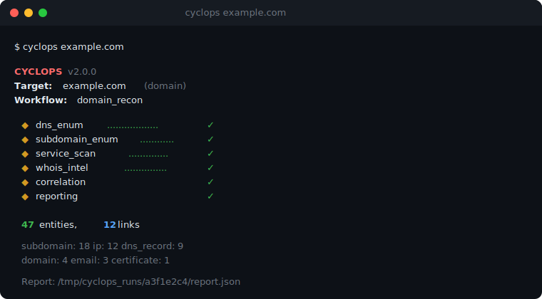
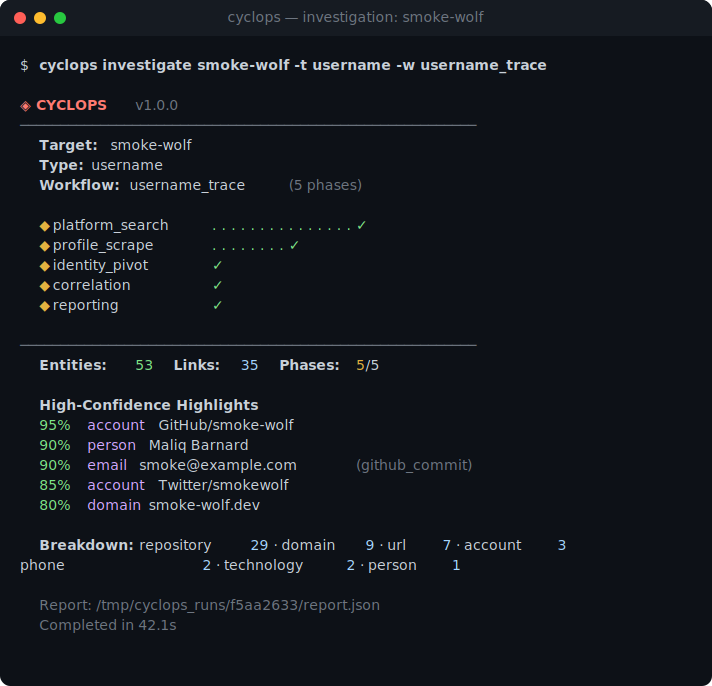
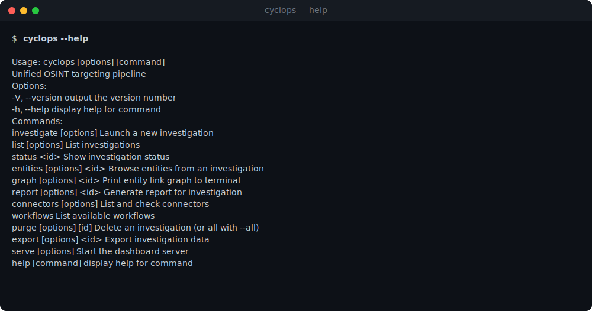
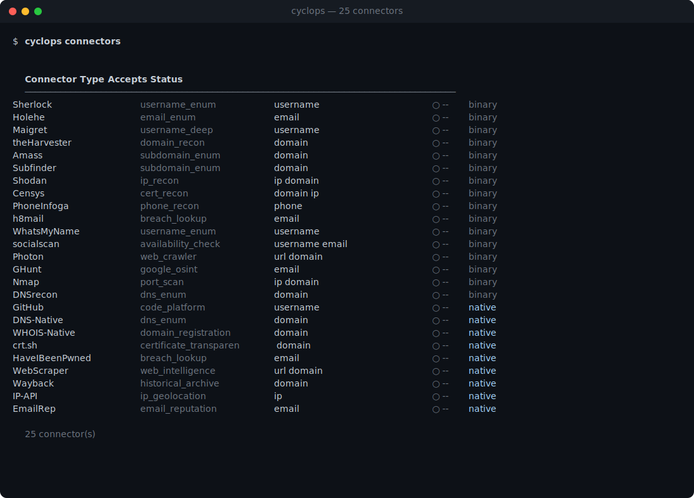
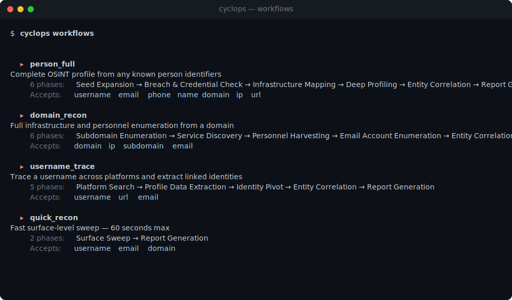
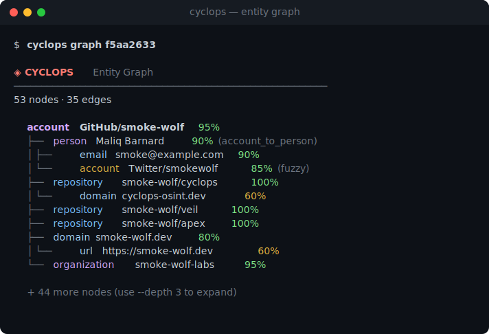
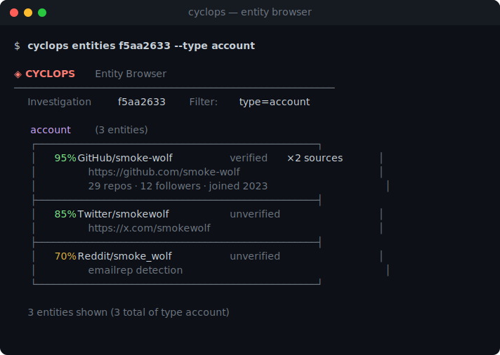
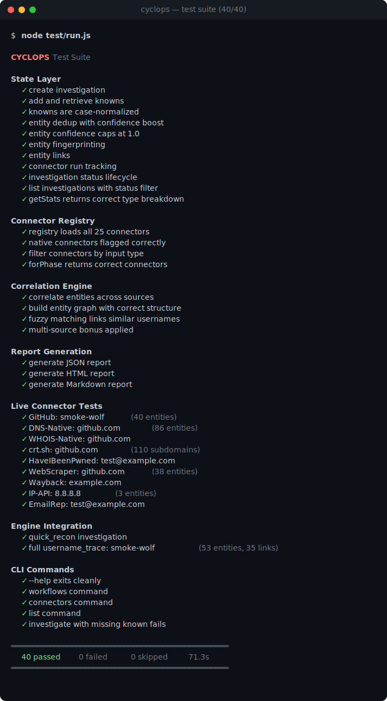

<p align="center">
  <h1 align="center">CYCLOPS</h1>
  <p align="center">Unified OSINT targeting pipeline. 32 connectors. Entity graph. Auto-correlation. One command.</p>
  <p align="center">
    <a href="https://github.com/smoke-wolf/cyclops/actions"></a>
    
    = 20">
    <a href="https://opensource.org/licenses/MIT"></a>
  </p>
</p>

<p align="center">
  
</p>

## Install

```bash
# Clone and install
git clone https://github.com/smoke-wolf/cyclops.git
cd cyclops && npm install

# Or run directly with npx
npx cyclops-osint smoke-wolf

# Or use Docker
docker build -t cyclops .
docker run --rm cyclops smoke-wolf
```

## Usage

```bash
# That's it. Auto-detects type, picks workflow, runs everything.
cyclops smoke-wolf

# Email → person_full workflow
cyclops john@example.com

# Domain → domain_recon workflow
cyclops example.com

# IP → domain_recon workflow
cyclops 8.8.8.8

# Override anything
cyclops target -t username -w person_full -k email:john@example.com
```

CYCLOPS auto-detects the input type (username, email, domain, IP, URL, phone), picks the right workflow, fans out across every available connector in parallel, builds an entity graph, correlates across sources, and generates a report. Zero config needed.



## CLI



| Command | Description |
|---------|-------------|
| `cyclops <target>` | Investigate (auto-detect type + workflow) |
| `investigate <target>` | Same, explicit subcommand |
| `list` | All investigations with status |
| `status <id>` | Full investigation breakdown |
| `entities <id>` | Browse, search, filter entities |
| `graph <id>` | Entity link tree |
| `report <id>` | Generate report (json, html, md) |
| `export <id>` | Export data (json, csv, ndjson) |
| `connectors` | List connectors (`--health`, `--native`) |
| `workflows` | Available workflows |
| `purge <id>` | Delete investigation (`--all`) |
| `serve` | Start dashboard server |

## Architecture

```
Target ──▶ Auto-Detect ──▶ Engine (DAG) ──▶ Connectors (32) ──▶ OSINT Sources
                               │                    │
                         Correlator            Telemetry
                         (fuzzy match,         (SSE, WS,
                          confidence)           SQLite)
                               │
                          Reporter
                        (JSON, HTML, MD)
```

Workflow phases resolve as a DAG — connectors within each phase run in parallel, output feeds the next phase. Entity dedup via SHA-256 fingerprinting. Correlation via Levenshtein fuzzy matching with configurable thresholds. Multi-source corroboration boosts confidence.

## Connectors



### Native (16) — zero dependencies

| Connector | Accepts | Outputs |
|-----------|---------|---------|
| GitHub | username | accounts, repos, emails, orgs, collaborators, gists |
| DNS-Native | domain | IPs, subdomains, records, SPF/DMARC emails |
| WHOIS-Native | domain | registrar, nameservers, contacts, dates |
| crt.sh | domain | subdomains, certificates (CT logs) |
| HaveIBeenPwned | email | breaches, pastes |
| WebScraper | url, domain | emails, social accounts, phones, tech stack |
| Wayback Machine | domain | archived URLs, interesting files, API endpoints |
| IP-API | ip | geolocation, ASN, reverse DNS, proxy detection |
| EmailRep | email | reputation, profiles, breach flags |
| VirusTotal | domain, ip, url | threat intel, subdomains, DNS, resolutions |
| Hunter | domain, email | employee emails, verification, org info |
| SecurityTrails | domain, ip | subdomains, DNS history, WHOIS, neighboring IPs |
| Shodan InternetDB | ip | open ports, vulns, hostnames, CPEs (no API key) |
| AlienVault OTX | domain, ip, url | threat pulses, passive DNS, malware samples |
| AbuseIPDB | ip | abuse score, ISP, proxy/tor detection, report count |
| URLScan | domain, url | IPs, certificates, technologies, resource domains |

### Binary (16) — auto-skipped if not installed

| Connector | Install |
|-----------|---------|
| Sherlock | `pip3 install sherlock-project` |
| Holehe | `pip3 install holehe` |
| Maigret | `pip3 install maigret` |
| theHarvester | `pip3 install theHarvester` |
| Amass | `go install github.com/owasp-amass/amass/v4/...@master` |
| Subfinder | `go install github.com/projectdiscovery/subfinder/v2/cmd/subfinder@latest` |
| Shodan | `pip3 install shodan` |
| Censys | `pip3 install censys` |
| PhoneInfoga | `go install github.com/sundowndev/phoneinfoga/v2@latest` |
| h8mail | `pip3 install h8mail` |
| WhatsMyName | `pip3 install whatsmyname` |
| socialscan | `pip3 install socialscan` |
| Photon | `pip3 install photon` |
| GHunt | `pip3 install ghunt` |
| Nmap | `brew install nmap` |
| DNSrecon | `pip3 install dnsrecon` |

Binary connectors are health-checked on startup — missing tools are silently skipped.

## Workflows



| Workflow | Phases | Best For |
|----------|--------|----------|
| `username_trace` | 5 | Usernames — cross-platform search, profile scrape, identity pivot |
| `person_full` | 6 | Emails/phones — full expansion, breach check, infrastructure, deep profiling |
| `domain_recon` | 6 | Domains/IPs — subdomains, services, personnel, email enum |
| `quick_recon` | 2 | Anything — 60-second surface sweep |

Auto-selected based on input type. Override with `-w`.

## Entity Graph



Correlation engine links entities across connectors using configurable rules and Levenshtein fuzzy matching. Multi-source corroboration boosts confidence.

**16 entity types:** person, account, email, domain, subdomain, ip, port, certificate, breach, credential, phone, url, dns_record, repository, organization, technology

## Entity Browser



```bash
cyclops entities <id>                    # grouped view
cyclops entities <id> --type account     # filter by type
cyclops entities <id> --high             # confidence > 80%
cyclops entities <id> --search github    # search data
cyclops entities <id> --json             # raw JSON
```

## API

| Method | Endpoint | Description |
|--------|----------|-------------|
| POST | `/api/investigate` | Launch (blocking) |
| POST | `/api/investigate/async` | Launch (non-blocking) |
| GET | `/api/investigations` | List all |
| GET | `/api/investigation/:id` | Status + stats |
| GET | `/api/investigation/:id/entities` | Entity list |
| GET | `/api/investigation/:id/graph` | Entity graph |
| GET | `/api/investigation/:id/report?format=html` | Report |
| POST | `/api/investigation/:id/abort` | Abort |
| GET | `/api/connectors` | Connector list + health |
| GET | `/api/workflows` | Workflow list |
| GET | `/api/events` | SSE event stream |

## Configuration

All behavior is config-driven:

- `config/connectors.json` — connector definitions, timeouts, input caps
- `config/workflows.json` — workflow phases, DAG dependencies, connector assignments
- `config/correlation.json` — entity types, linking rules, scoring thresholds

## API Keys (Optional)

```bash
export GITHUB_TOKEN=...        # 60 → 5000 req/hr
export SHODAN_API_KEY=...
export CENSYS_API_ID=...
export CENSYS_API_SECRET=...
export HUNTER_API_KEY=...      # domain email finder
export HIBP_API_KEY=...
export EMAILREP_API_KEY=...
export VIRUSTOTAL_API_KEY=...   # domain/IP/URL threat intel
export SECURITYTRAILS_API_KEY=... # DNS history, subdomains, WHOIS
export OTX_API_KEY=...         # AlienVault OTX threat intel (optional, works without)
export ABUSEIPDB_API_KEY=...   # IP abuse/reputation scoring
export URLSCAN_API_KEY=...     # URL/domain scanning (optional, works without)
export IP_API_KEY=...          # enables HTTPS via pro endpoint
```

## Testing



```bash
npm test    # 41 tests across all layers
```

41 tests: state management, connector registry, correlation engine, report generation, telemetry, live connectors (GitHub, DNS, WHOIS, crt.sh, HIBP, WebScraper, Wayback, IP-API, EmailRep), engine integration, and CLI.

## License

MIT
